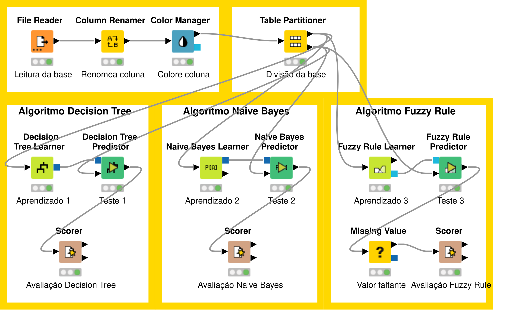

```{r setup, include=FALSE}
# Carregando e garantindo os pacotes para formatação de tabelas
if (!require("knitr")) install.packages("knitr")
if (!require("kableExtra")) install.packages("kableExtra")
library(knitr)
library(kableExtra)
options(knitr.table.format = "latex")
```

## 1. Introdução

  Este relatório apresenta a avaliação comparativa de três paradigmas distintos de classificação supervisionada aplicados ao clássico conjunto de dados Iris: Árvore de Decisão (Decision Tree), Classificador Bayesiano (Naive Bayes) e Regra Difusa (Fuzzy Rule). O objetivo é analisar o desempenho preditivo e as particularidades operacionais de cada algoritmo.

{#fig-workflow width=100%}

## 2. Tabela comparativa

  As métricas de Acurácia, Precisão, Recall e F1-Score foram consolidadas utilizando a abordagem global ponderada (overall/macro average) fornecida pelo nó Scorer do KNIME, garantindo uma base homogênea e justa de comparação entre as três arquiteturas.

```{r tabela_metricas, echo=FALSE}
# Criação dos dados da tabela comparativa com base nos dados reais das imagens
dados_metricas <- data.frame(
  Classificador = c("Decision Tree", "Naive Bayes", "Fuzzy Rule"),
  Acuracia = c("95.6%", "95.6%", "95.6%"),
  Precisao = c("95.5%", "95.5%", "95.5%"),
  Recall = c("95.5%", "95.5%", "95.5%"),
  F1 = c("95.5%", "95.5%", "95.5%")
)

# Renderização da tabela para PDF
kable(dados_metricas, 
      col.names = c("Classificador", "Acurácia (Overall)", "Precisão Média", "Recall Médio", "F1-Score Médio"),
      align = c("l", "c", "c", "c", "c"),
      booktabs = TRUE) %>%
  kable_styling(latex_options = c("striped", "hold_position")) %>%
  row_spec(0, bold = TRUE, background = "#1a5235", color = "white")
```

::: {.callout-warning}
### Nota Metodológica Importante

Durante a execução do preditor Fuzzy Rule Prediction, a instância identificada como Row77 (Classe Real: Iris-versicolor) resultou em um valor nulo (?) na coluna predita devido ao não acionamento de nenhuma regra difusa do modelo (suporte 0.0 para todas as classes). Alinhado às boas práticas de avaliação honesta de modelos, a linha não foi excluída do conjunto de teste. Utilizou-se o nó Missing Value para imputar estaticamente a categoria Nao_Classificado. Dessa forma, ela foi contabilizada estritamente como um erro de classificação do modelo Fuzzy, preservando o tamanho original da base (45 instâncias no teste) e garantindo a imparcialidade estatística.
:::

## 3. Matrizes de Confusão

  Abaixo estão dispostas as três matrizes de confusão extraídas diretamente do nó `Scorer` de cada modelo, permitindo a análise fina dos erros de omissão e comissão de cada classificador.

::: {layout-ncol=3}

```{r m_dt, echo=FALSE}
# Matriz de Confusão - Decision Tree
matriz_dt <- data.frame(
  Real = c("Setosa", "Versicolor", "Virginica"),
  Setosa = c(15, 0, 0),
  Versicolor = c(0, 14, 1),
  Virginica = c(0, 1, 14)
)

kable(matriz_dt, col.names = c("R \\ P", "Setosa", "Versi", "Virgi"), align = "lccc", booktabs = TRUE) %>%
  kable_styling(latex_options = "hold_position", font_size = 9) %>%
  row_spec(0, bold = TRUE, background = "#4a5568", color = "white")
```

```{r m_nb, echo=FALSE}
# Matriz de Confusão - Naive Bayes
matriz_nb <- data.frame(
  Real = c("Setosa", "Versicolor", "Virginica"),
  Setosa = c(15, 0, 0),
  Versicolor = c(0, 14, 1),
  Virginica = c(0, 1, 14)
)

kable(matriz_nb, col.names = c("R \\ P", "Setosa", "Versi", "Virgi"), align = "lccc", booktabs = TRUE) %>%
  kable_styling(latex_options = "hold_position", font_size = 9) %>%
  row_spec(0, bold = TRUE, background = "#4a5568", color = "white")
```

```{r m_fz, echo=FALSE}
# Matriz de Confusão - Fuzzy Rule
matriz_fz <- data.frame(
  Real = c("Setosa", "Versicolor", "Virginica"),
  Setosa = c(15, 0, 0),
  Versicolor = c(0, 14, 0),
  Virginica = c(0, 1, 14),
  N_C = c(0, 1, 0)
)

kable(matriz_fz, col.names = c("R \\ P", "Set", "Ver", "Vir", "N_C"), align = "lccccc", booktabs = TRUE) %>%
  kable_styling(latex_options = "hold_position", font_size = 9) %>%
  row_spec(0, bold = TRUE, background = "#4a5568", color = "white")
```

:::

<p style="font-size: 0.85em; color: #718096; text-align: center; margin-top: 5px;">
*Legenda: R = Classe de Referência Real; P = Classe Predita pelo Modelo; N_C = Não Classificado (Imputação de valor ausente por conta da Row77).*
</p>

## 4. Análise Crítica dos Resultados

  A análise comparativa dos três classificadores no dataset *Iris* revela como diferentes arquiteturas tratam fronteiras de decisão e incertezas. Por ser uma classe perfeitamente separável linearmente, a variedade *Iris-setosa* obteve 100% de acerto (15 de 15 instâncias) em todos os modelos. O desafio analítico concentrou-se estritamente na zona de transição e sobreposição entre as classes *Iris-versicolor* e *Iris-virginica*.

### 4.1. Desempenho e Diferença de Acurácia
  O experimento prático resultou em um empate técnico na Acurácia Geral de **95.6%** para as três abordagens, embora cada algoritmo tenha operado sob princípios distintos:

### 4.2. Dificuldade de Classificação e Separabilidade Biológica
  A classe em que todos os modelos mais erram é consistentemente a Iris-versicolor, seguida de perto pela Iris-virginica. Em contrapartida, a espécie Iris-setosa obteve 100% de acerto em todas as simulações e modelos.
Essa diferença deve-se a fatores ecológicos e morfológicos (separabilidade biológica):

  * Iris-setosa: Possui características físicas extremamente demarcadas, com pétalas consideravelmente menores que criam um agrupamento isolado no espaço de atributos (separabilidade linear perfeita).

  * Iris-versicolor e Iris-virginica: São filogeneticamente mais próximas e compartilham o mesmo nicho de crescimento, gerando uma sobreposição morfológica direta (comprimento e largura de pétalas muito similares). Essa intersecção física cria uma fronteira de decisão complexa e não linear, tornando o mapeamento matemático de transição inerentemente suscetível a erros de classificação cruzada.

### 4.3. Trade-off entre Interpretabilidade e Desempenho
  Este trade-off é um dos pilares mais importantes na tomada de decisão corporativa. A viabilidade de explicação varia drasticamente entre as arquiteturas:
  
  * Árvore de Decisão (Alta Interpretabilidade): É totalmente viável explicar a um leigo. O modelo pode ser traduzido diretamente em regras visuais e fluxogramas lógicos de "Se/Então" baseados em cortes rígidos (ex.: "Se a largura da pétala for menor que 1,6 cm, o cliente é de Médio Risco").
  
  * Fuzzy Rule (Interpretabilidade Média): É moderadamente viável. Embora utilize regras linguísticas amigáveis, a lógica difusa baseia-se em graus de pertinência contínuos (um elemento pode ser 30% Baixo Risco e 70% Médio Risco simultaneamente). Explicar essa sobreposição matemática a um gestor exige maior esforço didático.
  
  * Naive Bayes (Baixa Interpretabilidade): Não é viável para leigos. Suas decisões baseiam-se em densidades de probabilidade, produtórios de verossimilhanças e no Teorema de Bayes.

### 4.4. Análise de Reprodutibilidade (Alteração da Semente)

  Os resultados sofreram alterações claras. A Árvore de Decisão e o Fuzzy caíram de 95,6% para 93,3% de acurácia, enquanto o Naive Bayes manteve-se estável em 95,6%. O comportamento mais crítico ocorreu no modelo Fuzzy Rule: na nova semente, ele não gerou nenhum valor nulo (?) no teste, alcançando classificação completa (zero instâncias na classe Nao_Classificado).
  Isso prova que uma única execução não é confiável para atestar o desempenho real de um algoritmo. O particionamento aleatório simples (Holdout) é altamente sensível à distribuição pontual das amostras. Na primeira partição, um dado limítrofe atípico (Row77) foi enviado para o teste, desafiando a lógica Fuzzy. Na segunda partição, essa linha migrou para o treino ou foi substituída por dados mais comportados. Gerencialmente, para garantir robustez, deve-se adotar a Validação Cruzada (K-Fold) ou avaliar a média de múltiplas execuções aleatórias.

### 4.5. Recomendação Gerencial para Classificação de Risco

  Recomenda-se a adoção do classificador Árvore de Decisão (Decision Tree) para o mapeamento de perfis de risco. A decisão fundamenta-se nos seguintes critérios corporativos:
  
  * Explicabilidade e Defesa Jurídica: Setores de concessão de crédito e risco sofrem constantes auditorias. Caso um cliente conteste administrativamente ou judicialmente a recusa de uma operação, a Árvore de Decisão fornece um histórico auditável e lógico das regras exatas que geraram aquela classificação de risco.
  
  * Robustez e Estabilidade de Desempenho: O modelo manteve um desempenho competitivo e equivalente aos demais nas duas partições simuladas, provando-se estável perante variações amostrais.
  
  * Facilidade de Manutenção e Implementação: Diferente de motores de inferência difusa ou densidades probabilísticas gaussianas, as regras lógicas de uma Árvore de Decisão podem ser codificadas diretamente em estruturas condicionais simples (como instruções CASE WHEN ou blocos if/else em R). Isso permite a integração imediata em qualquer banco de dados ou sistema legado da empresa, minimizando custos de engenharia e manutenção de software.